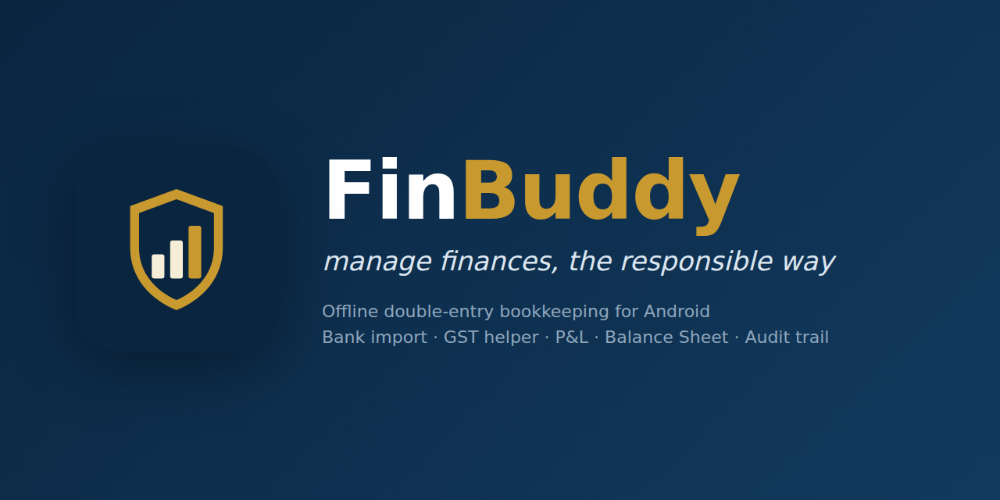
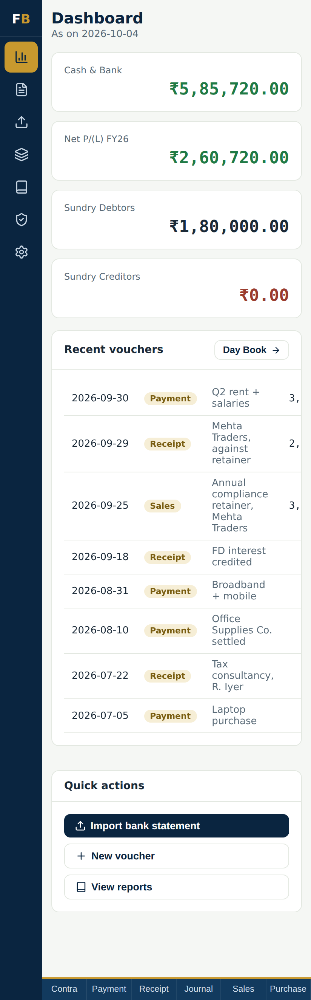
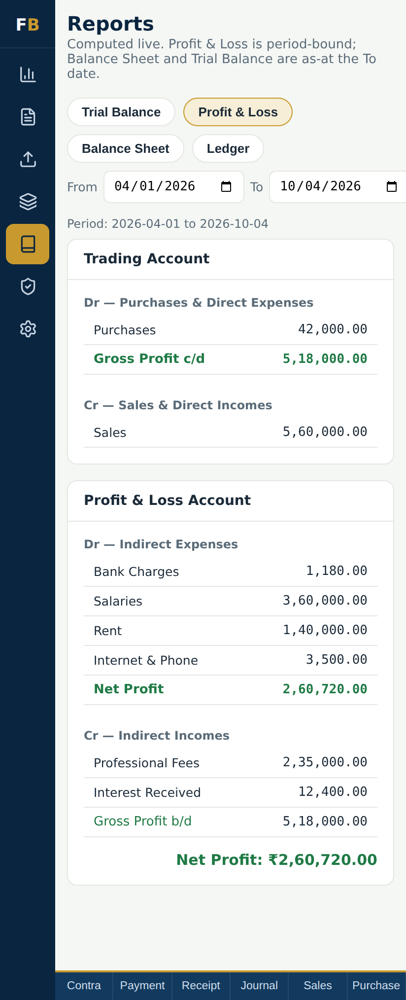
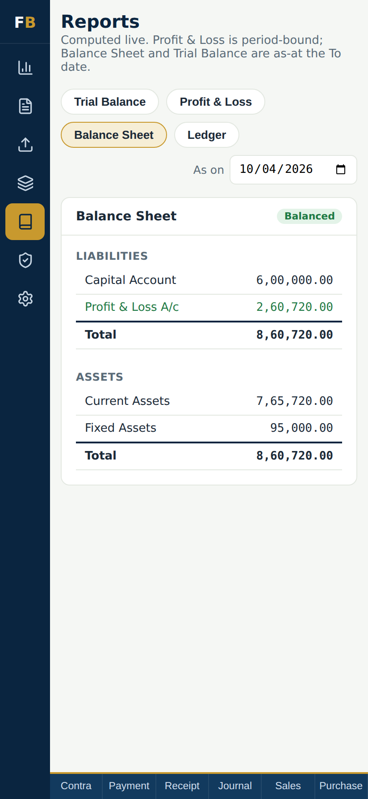
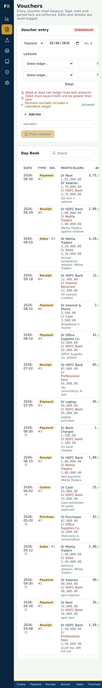
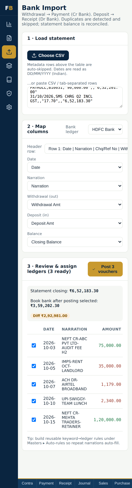
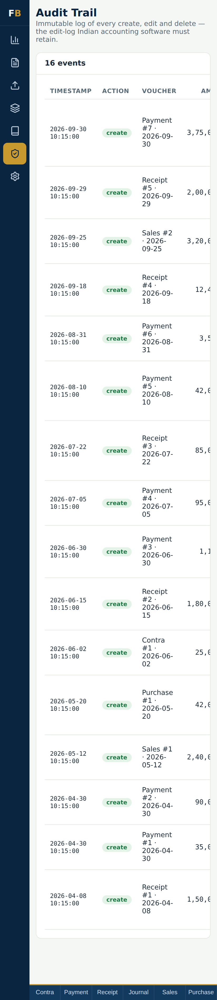
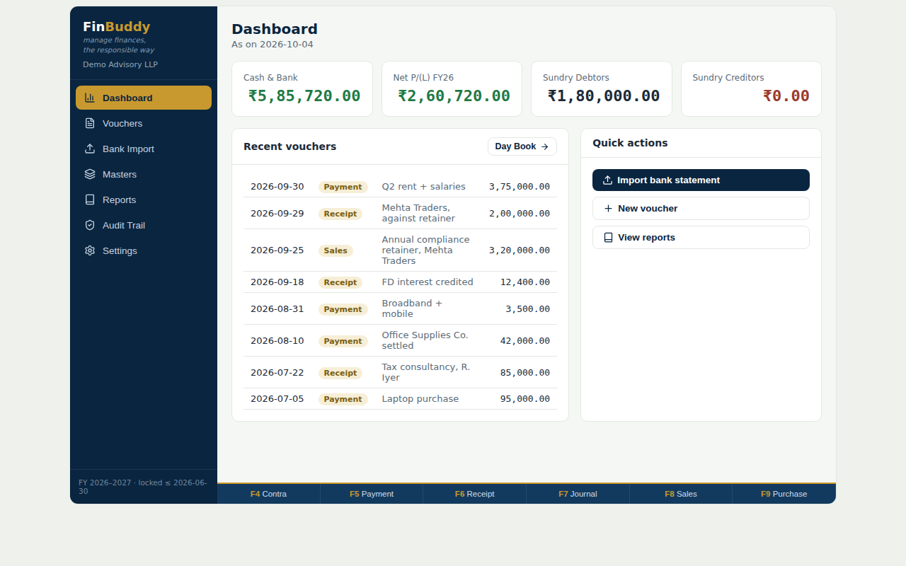
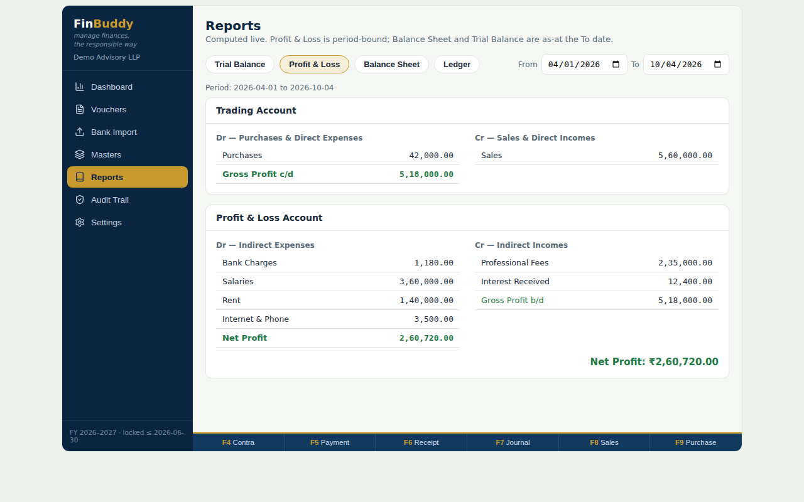
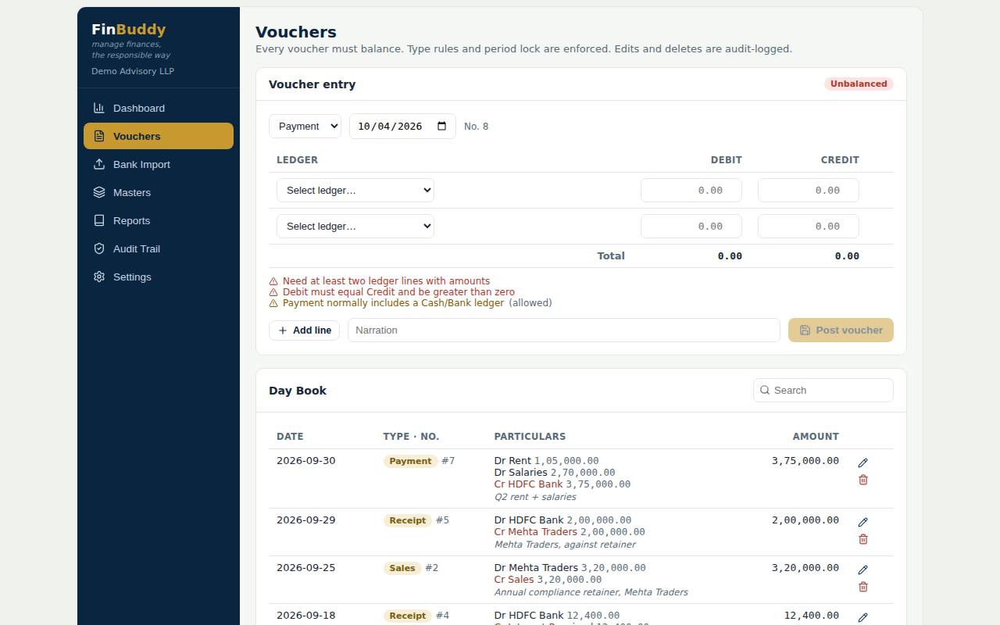

<p align="center">
  
</p>

<p align="center">
  <a href="https://bharathunni.github.io/Finbuddy-bookkeeping/"></a>
  <a href="https://github.com/bharathunni/finbuddy-bookkeeping/actions/workflows/ci.yml"></a>
  
  <a href="LICENSE"></a>
</p>

# FinBuddy

**Manage finances, the responsible way.**

FinBuddy is an offline-first, double-entry bookkeeping app for Android, designed by a Chartered Accountant. It brings the discipline of professional accounting software (vouchers, groups, ledgers, trial balance, final accounts, audit trail, period lock) to a pocket-sized app, with zero cloud dependency. Your books never leave your device.

It is built for freelancers, consultants, small business owners and finance-minded individuals who want real books, not a glorified expense tracker.

> **[Try it in your browser](https://bharathunni.github.io/Finbuddy-bookkeeping/)**, no install. The hosted demo opens on synthetic sample books for a fictional firm; anything you change stays in your browser. Download the sample bank CSV from the demo banner, import it under **Bank Import**, post it, then import it again to watch every line get caught as a duplicate.

---

## Design decisions

**Every number is computed by explicit rules, not AI.** Books have to balance to the paisa and give the same answer every time, so nothing in FinBuddy is probabilistic or learned.

- **Duplicate detection is exact-match.** A bank line is a duplicate only if bank ledger, date, amount (to the paisa) and narration all match an existing Payment or Receipt. No fuzzy matching: a false "duplicate" silently drops a real transaction, which is worse than asking the user to look.
- **Reconciliation is arithmetic.** Book balance after posting is compared with the statement's closing balance; the app shows either "Reconciles" or the exact unaccounted difference in rupees.
- **Auto-categorisation is keyword rules the user writes** ("RENT" to Rent, "SALARY" to Salaries), visible and editable, never a model's guess.
- **Vouchers cannot post unless Dr = Cr**, and every create, edit and delete lands in the audit trail.

AI was used as leverage to build the app quickly. It is not in the runtime path.

---

## Screenshots

| Dashboard | Profit & Loss | Balance Sheet |
| :---: | :---: | :---: |
|  |  |  |

| Voucher entry | Bank import | Audit trail |
| :---: | :---: | :---: |
|  |  |  |

<details>
<summary>Tablet / desktop layout</summary>





</details>

---

## Features

### Accounting engine
- **True double-entry.** Every voucher must balance (Dr = Cr, to the paisa) before it can be posted.
- **Six voucher types** with type-specific validation: Contra, Payment, Receipt, Journal, Sales, Purchase. Contra is restricted to cash and bank ledgers; Payment, Receipt, Journal, Sales and Purchase raise warnings when they deviate from standard practice.
- **28 pre-seeded account groups** following the standard Indian chart of accounts, so every ledger lands correctly in the Trading Account, P&L or Balance Sheet.
- **Opening balance check.** The app flags any Dr/Cr mismatch in opening balances before it can corrupt the Trial Balance.
- **Paise-accurate arithmetic** with explicit rounding at every step to avoid floating-point drift.
- **Indian number formatting** (lakh / crore grouping: 12,34,567.00).

### Reports (computed live)
- **Trial Balance** as at any date, with a "Balanced" check.
- **Trading and Profit & Loss Account** for any period, with gross and net profit carried down correctly.
- **Balance Sheet** as at any date, with cumulative profit so it ties across financial years.
- **Ledger statement** with running balance.
- **Dashboard** showing cash and bank position, FY-to-date profit, debtors, creditors and recent activity.

### Bank statement import
- Import any bank's **CSV** export. Date, narration, withdrawal, deposit and balance columns are auto-detected, with a manual override for the header row and each column.
- Understands common Indian date formats (`dd/mm/yyyy`, `dd-Mon-yy`, ISO) and amount formats (`₹`, commas, `Cr`/`Dr` suffixes).
- Withdrawals become **Payment** vouchers, deposits become **Receipt** vouchers.
- **Duplicate detection** skips transactions already in your books.
- **Auto-categorisation rules** (keyword to ledger), so "RENT" or "SALARY" lines are pre-assigned.
- **Reconciliation** of statement closing balance against book balance.

### Controls (the CA part)
- **Audit trail.** Every create, edit and delete is logged with timestamp and full entry detail, in line with the edit-log requirement for Indian accounting software.
- **Period lock.** Freeze books up to a date so filed periods cannot be altered.
- **Financial year aware.** April to March by default, with a configurable books-beginning date.
- **Optional GST helper.** Builds the CGST/SGST or IGST split for Sales and Purchase vouchers from a taxable value and rate.

### Privacy and data
- **100% offline.** No account, no server, no analytics, no third-party SDKs.
- Data is stored on-device (Android SharedPreferences via Capacitor, mirrored to WebView storage) and **autosaves on every change**.
- **JSON backup and restore** through the Android share sheet, so you can move books between devices or keep an off-device copy.

### Usability
- Responsive layout: full sidebar on tablets and desktop, compact icon rail on phones.
- Keyboard shortcuts **F4 to F9** for voucher types, familiar to Indian accountants.

---

## Try it / install

- **Browser (no install):** [bharathunni.github.io/Finbuddy-bookkeeping](https://bharathunni.github.io/Finbuddy-bookkeeping/). Synthetic sample books, stored only in your browser.
- **Android:** every CI run on `main` builds a debug APK, downloadable from the run's **Artifacts** (`FinBuddy-debug-apk`) on the [Actions tab](https://github.com/bharathunni/finbuddy-bookkeeping/actions/workflows/ci.yml). Sideload on Android 7.0 or later and allow installation from this source. Or build it yourself (below).
- **Your own data in the browser:** run `npm run dev` locally, then **Settings > Backup & data > Restore** with [`docs/demo-books.json`](docs/demo-books.json) or your own backup, and try importing [`docs/sample-bank-statement.csv`](docs/sample-bank-statement.csv).

---

## Tech stack

| Layer | Choice | Why |
| --- | --- | --- |
| UI | React 19 | Component model, hooks, memoised computation |
| Build | Vite 8 | Fast dev server and production bundling |
| Native shell | Capacitor 8 | Ships the web app as a real Android APK with native storage and share APIs |
| Storage | `@capacitor/preferences` | Native key-value storage, no database server |
| Files | `@capacitor/filesystem` + `@capacitor/share` | Backup export via the Android share sheet |
| CSV | PapaParse | Robust parsing of messy bank exports |
| Icons | lucide-react | Lightweight, consistent icon set |

### Architecture

```
src/App.jsx
 ├─ Storage layer      loadDb / persist / migrate     on-device, versioned schema
 ├─ Engine             makeCalc (single pass, memoised) → opening / closing / movement per ledger
 │                     computePL, cumulativeProfit       → Trading, P&L, Balance Sheet
 ├─ Validation         validateVoucher                   → balance, period lock, voucher-type rules
 └─ Views              Dashboard · Vouchers · Bank Import · Masters · Reports · Audit Trail · Settings
```

The ledger engine indexes all voucher lines by ledger once per change and derives every report from that index, so reports stay instant even with thousands of vouchers.

---

## Project structure

```
.
├── src/                 React application (App.jsx, entry point, global styles)
├── public/              Static web assets (favicon)
├── android/             Capacitor Android project (Gradle)
├── docs/
│   ├── brand/           Logo, mark and banner
│   ├── screenshots/     README screenshots
│   ├── demo-books.json  Synthetic sample company (loaded by the hosted demo)
│   └── sample-bank-statement.csv
├── capacitor.config.json
├── vite.config.js
└── package.json
```

---

## Build from source

**Prerequisites:** Node.js 20+, and for the APK: JDK 21 and Android Studio (or the Android SDK command-line tools).

```bash
git clone https://github.com/bharathunni/finbuddy-bookkeeping.git
cd finbuddy-bookkeeping
npm ci

# Run in the browser (hot reload)
npm run dev

# Lint and production web build
npm run lint
npm run build

# Demo build, as hosted on GitHub Pages (opens on the sample books)
VITE_DEMO=1 npm run build
```

### Android APK

```bash
npm run android:sync    # vite build + copy web assets into android/
npm run android:open    # open in Android Studio, then Build > Build APK(s)

# or headless:
npm run android:apk     # outputs android/app/build/outputs/apk/debug/app-debug.apk
```

For a Play Store release build, create a keystore and configure `signingConfigs` in `android/app/build.gradle`, then run `./gradlew bundleRelease` inside `android/`.

---

## Roadmap

- [ ] Inventory (stock items, FIFO / weighted average valuation)
- [ ] Bill-wise outstanding and ageing for debtors and creditors
- [ ] GSTR-1 / GSTR-3B summary export
- [ ] PDF export of final accounts
- [ ] Optional encrypted backup to user-chosen cloud storage
- [ ] Multi-company support

---

## Author

**Bharath Unni**, Chartered Accountant.
Designed the accounting model, validation rules and reporting logic, and built the app end to end.

## License

Released under the [MIT License](LICENSE).
